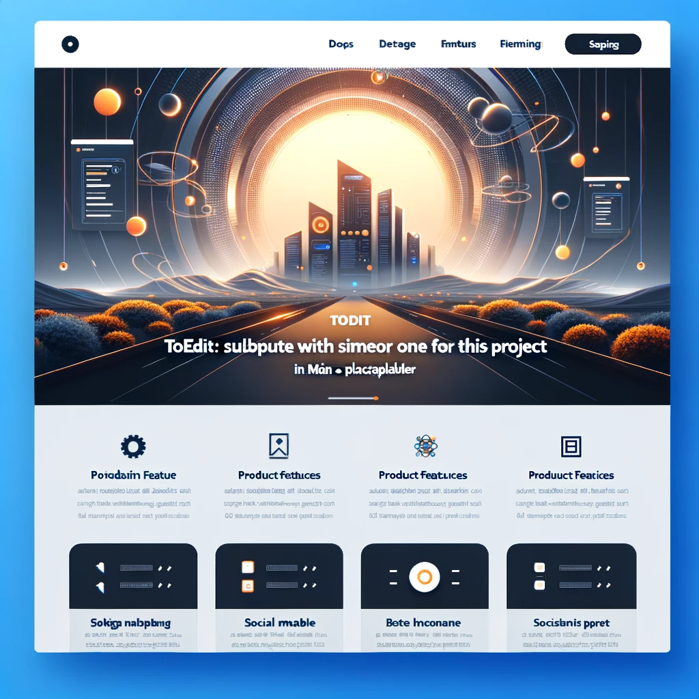

<a name="readme-top"></a>

<!-- 
  REMEMBER THAT AT THE END OF THE MARKDOWN PAGES, THERE IS A SECTION WITH ALL THE LINKS TO BE MODIFIED OR ADDED NEW.
  This increases readability.
 -->

[![contributors-shield]][contributors-url]
[![forks-shield]][forks-url]
[![stars-shield]][stars-url]
[![issues-shield]][issues-url]
[![license-shield]][license-url]
[![linkedin-shield]][linkedin-url]
[![youtube-shield]][youtube-url]
![twitter-shield]

Don't forget to give the project a star if you liked it! Thanks again! :star2: :yellow_heart:

<!-- PROJECT LOGO -->
<br />
<div align="center">
  <a href="PROJECT_URL_TO_REPLACE">
    
  </a>

  <h3 align="center">TOEDIT: PROJECT NAME</h3>

  <p align="center">
    TOEDIT: PROJECT BRIEFING - 1-2 Lines About the project
    <br />
    <blockquote style="border-left: 4px solid red; background-color: lightgray; padding: 10px; text-align: left;">
        <strong><span style="color: red;">Note:</span></strong> <span style="color: black;">Do not forget to change <b>PROJECT_URL_TO_REPLACE</b> with the actual URL of the project.</span>
    </blockquote>
    <blockquote style="border-left: 4px solid red; background-color: lightgray; padding: 10px; text-align: left;">
        <strong><span style="color: red;">Note:</span></strong> <span style="color: black;">Do not forget to edit the following links when creating the project from the template.</span>
    </blockquote>
    <a href="">View Demo</a>
    ·
    <a href="PROJECT_URL_TO_REPLACE/issues">Report Bug</a>
    ·
    <a href="PROJECT_URL_TO_REPLACE/issues">Request Feature</a>
  </p>
</div>


<!-- TABLE OF CONTENTS -->
<details>
  <summary><b>Index</b></summary>
  <ol>
    <li>
      <a href="#about-the-project">About The Project</a>
      <ul>
        <li><a href="#built-with">Built With</a></li>
        <li><a href="#architecture">Architecture</a></li>
      </ul>
    </li>
    <li>
      <a href="#getting-started">Getting Started</a>
      <ul>
        <li><a href="#prerequisites">Prerequisites</a></li>
        <li><a href="#installation">Installation</a></li>
      </ul>
    </li>
    <li><a href="#usage">Usage</a></li>
    <li><a href="#roadmap">Roadmap</a></li>
    <li><a href="#contributing">Contributing</a></li>
    <li><a href="#license">License</a></li>
    <li><a href="#contact">Contact</a></li>
    <li><a href="#acknowledgments">Acknowledgments</a></li>
  </ol>
</details>


<!-- ABOUT THE PROJECT -->
## About The Project

<p align="center">
    <a href="PROJECT_URL_TO_REPLACE">
        
    </a>
    <p align="center" style="color: lightgray; font-size: small; font-style: italic; padding: 0px; margin: 0px">TOEDIT: Modify the caption</p>
</p>

<!-- PROJECT DETAILS -->
</br>
</br>
</br>
<table style="width: 100%; border-collapse: collapse;">
    <tr>
        <td style="font-weight: bold; padding: 8px; color: #4a579d">Purpose</td>
        <td style="padding: 8px; text-align: left;">TOEDIT: text describing the purpose</td>
    </tr>
    <tr>
        <td style="font-weight: bold; padding: 8px; color: #3a9ba5">Motivation</td>
        <td style="padding: 8px; text-align: left;">TOEDIT: text describing what problems it solves</td>
    </tr>
    <tr>
        <td style="font-weight: bold; padding: 8px; color: #2d6b99">Features</td>
        <td style="padding: 8px; text-align: left;">
            <ul>
                <!-- TOEDIT: ADD HERE ALL THE LIST OF MAIN FEATURES OF THE PROJECT -->
                <li>TOEDIT: Feature 1</li>
                <li>Feature 2</li>
                <li>Feature 3</li>
            </ul>
        </td>
    </tr>
</table>


### Built With

<!-- TECHNOLOGIES TABLE -->
<table style="width: 100%; border-collapse: collapse;">
  <!-- THESE ARE THE ONES WITHOUT AVAILABLE BADGE AT shields.io -->
    <!-- Docker -->
    <tr>
        <td style="text-align: left; width: 200px;">
            <div style="background-color: #585858; padding: 5px 10px; display: inline-block; margin: 2px; font-family: Arial, sans-serif; font-size: 0.8em; font-weight: 800;">
                 
                <span style="color: white; vertical-align: middle;"><b>DOCKER</b></span>   
            </div>
        </td>
        <td style=" text-align: left;">TOEDIT: Usage</td>
    </tr>
    <!-- Kubernetes -->
    <tr>
        <td style="text-align: left; max-width: 100px;">
            <div style="background-color: black; padding: 5px 10px; display: inline-block; margin: 2px; font-family: Arial, sans-serif; font-size: 0.8em; font-weight: 800;">
                 
                <span style="color: white; vertical-align: middle;"><b>KUBERNETES</b></span>   
            </div>
        </td>
        <td style=" text-align: left;">TOEDIT: Usage</td>
    </tr>
    <!-- THE FOLLOWING STYLE IS FOR THE ONES THAT HAVE AN AVAILABLE BADGE AT shields.io -->
    <!-- React -->
    <tr>
        <td style=" text-align: left; max-width: 100px;">
            <div style="padding: 5px 10px; display: inline-block; margin: 2px; font-family: Arial, sans-serif; font-size: 0.8em; font-weight: 800;">
                 
            </div>
        </td>
        <td style="text-align: left;">TOEDIT: Usage</td>
    </tr>
    <!-- Python -->
    <tr>
        <td style=" text-align: left; max-width: 100px;">
            <div style="padding: 5px 10px; display: inline-block; margin: 2px; font-family: Arial, sans-serif; font-size: 0.8em; font-weight: 800;">
                 
            </div>
        </td>
        <td style="text-align: left;">TOEDIT: Usage</td>
    </tr>
</table>

</br>
Other utilities, dependencies and plugins are listed below in <b>acknowledges</b> section
<!-- END TECHNOLOGIES TABLE -->


### Architecture

<p align="center">
    
    <p align="center" style="color: lightgray; font-size: small; font-style: italic; padding: 0px; margin: 0px">Project Architecture</p>
</p>

<b>Components</b>

* `CLI`: All the files in this project.
  * `main.py`: Main handler that orchestrates
  * `dispatcher.py`: Dispatches services
* `API Server`: serves the responses to CLI Requests. The related project can be located [TOEDIT: HERE](https://example.com)

<p align="right">(<a href="#readme-top">back to top</a>)</p>


<!-- GETTING STARTED -->
## Getting Started

In this section we hope to explain thoroughly how to get things going seemingly. 
Please read carefully and <b>May the force be with you</b> :hatched_chick: :hatched_chick: :hatched_chick:

### Prerequisites

* `npm`:
  ```sh
  npm install npm@latest -g
  ```

### Installation

#### Locally

1. Get a free API Key at [https://example.com](https://example.com)
2. Clone the repo
   ```sh
   git clone https://github.com/your_username_/Project-Name.git
   ```
3. Install NPM packages
   ```sh
   npm install
   ```
4. Enter your API in `config.js`
   ```js
   const API_KEY = 'ENTER YOUR API';
   ```

#### With Docker

<p align="right">(<a href="#readme-top">back to top</a>)</p>


<!-- USAGE EXAMPLES -->
## Usage

---

TOEDIT: Use this space to show useful examples of how a project can be used. Additional screenshots, code examples and demos work well in this space. You may also link to more resources. 
* CLI: In this case show the help and put some examples of the most interesting options
* Web Application: if the project is a component of a broader project, link it ot the main Documentation for the project usage and especify only the specific configurations for the component. Example: if this is the front end, talk about the specific options that can be configured.

---

_For more examples, please refer to the [Documentation](https://example.com)_

<p align="right">(<a href="#readme-top">back to top</a>)</p>


<!-- ROADMAP -->
## Roadmap

- [x] Add Changelog
- [x] Add back to top links
- [ ] Add Additional Templates w/ Examples
- [ ] Add "components" document to easily copy & paste sections of the readme
- [ ] Multi-language Support
    - [ ] Chinese
    - [ ] Spanish

See the [open issues](PROJECT_URL_TO_REPLACE/issues) for a full list of proposed features (and known issues).

For a more detailed understanding of the project progress, check the <a href="docs/CHANGELOG.md">CHANGELOG</a>

<p align="right">(<a href="#readme-top">back to top</a>)</p>


<!-- CONTRIBUTING -->
## Contributing

Contributions are what make the open source community such an amazing place to learn, inspire, and create. Any contributions you make are **greatly appreciated** :chart:.

If you have a suggestion that would make this better, please fork the repo and create a pull request. You can also simply open an issue with the tag "enhancement".

1. Fork the Project
2. Create your Feature Branch (`git checkout -b feature/AmazingFeature`)
3. Commit your Changes (`git commit -m 'Add some AmazingFeature'`)
4. Push to the Branch (`git push origin feature/AmazingFeature`)
5. Open a Pull Request

<p align="right">(<a href="#readme-top">back to top</a>)</p>


<!-- LICENSE -->
## License

Distributed under the `TOEDIT: LICENSE_TYPE_TO_REPLACE` License. See `LICENSE` for more information.

<p align="right">(<a href="#readme-top">back to top</a>)</p>


<!-- CONTACT -->
## Contact

As we always state, our main purpose is keep learning, contributing to the community and finding ways to collaborate in interesting initiatives.
Do not hesitate to contact us at `codetriariism@gmail.com`

If you are interested in our content creation, also check our social media accounts. We have all sorts of training resources, blogs, hackathons, write-ups and more!
Do not skip it, you will like it :smirk: :smirk: :smirk:

<table>
    <tr>
        <td></td>
        <td><a href="https://www.instagram.com/codetriariismig/">Instagram</a></td>
    </tr>
    <tr>
        <td></td>
        <td><a href="https://www.youtube.com/@CodeTriariiSM">YouTube</a></td>
    </tr>
    <tr>
        <td></td>
        <td><a href="https://medium.com/@codetriariism">Medium</a></td>
    </tr>
    <tr>
        <td></td>
        <td><a href="https://www.tiktok.com/@codetriariism">TikTok</a></td>
    </tr>
    <tr>
        <td></td>
        <td><a href="https://twitter.com/codetriariism">Twitter</a></td>
    </tr>
</table>


<p align="right">(<a href="#readme-top">back to top</a>)</p>


<!-- ACKNOWLEDGMENTS -->
## Acknowledgments

:100: :100: :100: For those that are curious about some of the resources or utilities and for sure thanking and giving credit to authors, we provide you a list of the most interesting ones (in our understanding) :100: :100: :100:

* [Choose an Open Source License](https://choosealicense.com)
* [GitHub Emoji Cheat Sheet](https://www.webpagefx.com/tools/emoji-cheat-sheet)
* [Malven's Flexbox Cheatsheet](https://flexbox.malven.co/)
* [Malven's Grid Cheatsheet](https://grid.malven.co/)
* [Img Shields](https://shields.io)
* [GitHub Pages](https://pages.github.com)
* [Font Awesome](https://fontawesome.com)
* [React Icons](https://react-icons.github.io/react-icons/search)

<p align="right">(<a href="#readme-top">back to top</a>)</p>


<!-- MARKDOWN LINKS & IMAGES -->
<!-- https://www.markdownguide.org/basic-syntax/#reference-style-links -->
[contributors-shield]: https://img.shields.io/github/contributors/othneildrew/Best-README-Template.svg?style=for-the-badge
[contributors-url]: PROJECT_URL_TO_REPLACE/graphs/contributors
[forks-shield]: https://img.shields.io/github/forks/othneildrew/Best-README-Template.svg?style=for-the-badge
[forks-url]: PROJECT_URL_TO_REPLACE/network/members
[stars-shield]: https://img.shields.io/github/stars/othneildrew/Best-README-Template.svg?style=for-the-badge
[stars-url]: PROJECT_URL_TO_REPLACE/stargazers
[issues-shield]: https://img.shields.io/github/issues/othneildrew/Best-README-Template.svg?style=for-the-badge
[issues-url]: PROJECT_URL_TO_REPLACE/issues
[license-shield]: https://img.shields.io/github/license/othneildrew/Best-README-Template.svg?style=for-the-badge
[license-url]: PROJECT_URL_TO_REPLACE/blob/master/LICENSE

<!-- SOCIAL MEDIA -->
[linkedin-shield]: https://img.shields.io/badge/-LinkedIn-black.svg?style=for-the-badge&logo=linkedin&colorB=gray
[linkedin-url]: https://example.com

[youtube-shield]: https://img.shields.io/badge/YouTube-red?style=for-the-badge&logo=youtube&logoColor=white
[youtube-url]: https://www.youtube.com/@CodeTriariiSM

[instagram-shield]: https://img.shields.io/badge/Instagram-E4405F?style=for-the-badge&logo=instagram&colorB=pink
[instagram-url]: https://www.instagram.com/codetriariismig/

[twitter-shield]: https://img.shields.io/twitter/follow/codetriariism

<!-- PROJECT RELATED -->
[product-brand-image]: docs/img/main.png