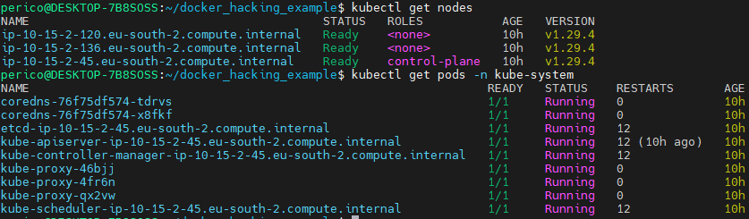

<div align="center">
<!--
  REMEMBER THAT AT THE END OF THE MARKDOWN PAGES, THERE IS A SECTION WITH ALL THE LINKS TO BE MODIFIED OR ADDED NEW.
  This increases readability.
 -->

<!-- PROJECT LOGO -->
# 📝 # AWS Kubeadm Simple Cluster Training

<!-- TECNOLOGIES -->


This is a simple (but effective) project that allows to quickly set-up a kubeadm cluster (`single master`) in AWS environment.
It includes the possibility of creating the VPC, subnet, security groups and more for you.

You can place it as well in your existing VPC and create the subnet, or place it inside your existing subnet.

It is quite flexible. Enjoy it!

[Report Bug](https://github.com/paf-triarii/aws-kubeadm-simple-cluster-training/issues) · [Request Feature](https://github.com/paf-triarii/aws-kubeadm-simple-cluster-training/issues)
</div>

<!-- TABLE OF CONTENTS -->

## 📚 Table of contents

- [📝 # AWS Kubeadm Simple Cluster Training](#--aws-kubeadm-simple-cluster-training)
  - [📚 Table of contents](#-table-of-contents)
  - [💡 Details](#-details)
    - [Resources](#resources)
  - [🚀 Installation and Execution](#-installation-and-execution)
    - [🔧 Installation](#-installation)
      - [Local environment](#local-environment)
      - [Docker](#docker)
    - [💼 Usage](#-usage)
      - [Locally](#locally)
      - [With Docker](#with-docker)
    - [🛜 Connect to instances](#-connect-to-instances)
  - [📍 Roadmap](#-roadmap)
  - [📎 Contributing](#-contributing)
  - [📃 License](#-license)
  - [👥 Contact](#-contact)

<!--te-->

## 💡 Details

### Resources

The main resources for this project are located inside `provisioner` folder where the Ansible code is located.

Inside this folder we will find:

- `aws`:
  - `ansible`: containing the Ansible configuration, the different related playbooks (all started with `main.yml`) and the [env_variables_aws.yaml](./provisioner/aws/ansible/env_variables_aws.yaml) containing the changeable configuration.
    - `modules`: those define the specific behavior for preparing the AWS related resources (`Internet Gateway, Instances, Route Tables, Security Groups, Subnet and VPCs`)
- `filter_plugins`: Global plugins that are used for simplification of some tasks.
- `Dockerfile`: for building the image to run the Ansible and Terraform dynamically generated project without having to install anything besides `Docker`.
- `.dockerignore`: To exclude some files from the image build for security and *keeping it clean* purposes.
- `password_retriever.py`: Utility for getting the password in clear text for the windows instance decrypting it using the private key for the instance.
  
> [!IMPORTANT]
> Do not forget to set the ANSIBLE_FILTER_PLUGINS environment variable to the absolute path where the custom_filters are located with the actual path of the project.

## 🚀 Installation and Execution

### 🔧 Installation

> [!CAUTION]
> Remember to review the env variables. This playbook has direct support for several regions but do not cover all. Include your region and ami if missing in the list.

#### Local environment

1. Install Python.

```bash
sudo apt-get update && apt-get install -y python3 python3-pip
```

2. Install Ansible:

```bash
pip install ansible==9.4.0
```

3. Install Ansible collection for aws:

```bash
ansible-galaxy collection install amazon.aws
```

4. Install boto3 with pip.

```bash
pip3 install boto3 botocore
```

5. Install Terraform following [Official instructions from Hashicorp documentation](https://developer.hashicorp.com/terraform/tutorials/aws-get-started/install-cli).

> [!TIP]
> You can decide which version to install by checking [PIP Ansible release history](https://pypi.org/project/ansible/#history)

#### Docker

You just have to build the Docker image!

```bash
docker build provisioner -f provisioner/Dockerfile -t cluster-provider:1.0 \
--build-arg UID=$(id -u) --build-arg GID=$(id -g) --build-arg USER=$(id -un) --build-arg GROUP=$(id -gn)
```

### 💼 Usage

> [!IMPORTANT]
> Do not forget to set at least your public IP in the rules of the security groups to be able to access using the SSH generated key after launching the playbook.

#### Locally

1. Set the required environment variables. If you do not have such, please check Amazon documentation on how to generate those here.

```bash
export AWS_REGION="eu-south-2"
export AWS_ACCESS_KEY_ID="REAL_VALUE_OF_AWS_ACCESS_KEY_ID"
export AWS_SECRET_ACCESS_KEY="REAL_VALUE_OF_AWS_SECRET_ACCESS_KEY"
```

2. Remember to change the [Ansible env variables as your desired configuration](./provisioner/aws/ansible/env_variables_aws.yaml).

3. Ensure to set the filter plugins env variable and make those available:

```bash
cp -r provisioner/filter_plugins ${HOME}
export ANSIBLE_FILTER_PLUGINS="${HOME}/filter_plugins"
export ANSIBLE_HOST_KEY_CHECKING=False
```

4. Run the playbook.

```bash
ansible-playbook provisioner/aws/main.yaml -vv
```

5. If successful, run the configuration playbook:

```bash
ansible-playbook aws/ansible/conf/main.yaml -i inventory.ini
```

#### With Docker

If you have built the image and adapted the [Ansible env variables as your desired configuration](./provisioner/aws/ansible/env_variables_aws.yaml), then you just need to execute this!

```bash
docker run --user $(id -u):$(id -g) -v $(pwd)/provisioner:/app  -e AWS_ACCESS_KEY_ID="" -e AWS_SECRET_ACCESS_KEY="" \
-e AWS_REGION="eu-west-2"   -e VERBOSITY="-vvv" -e ANSIBLE_FILTER_PLUGINS=/app/filter_plugins cluster-provider:1.0
```

> [!IMPORTANT]
> Do not forget to set the real values for `AWS_ACCESS_KEY_ID` and `AWS_SECRET_ACCESS_KEY`.

### 🛜 Connect to instances

1. Obtain the ssh key for the instances in:

```bash
cd $(find $(pwd) -type d -name infra-provision*)/bsa-auto-infra/modules/key
```

> [!TIP]
> If you have enabled the creation of client vpn, follow the next steps. **Make sure to select your region first!**

3. Navigate to [Client VPNS](https://eu-west-2.console.aws.amazon.com/vpc/home?region=eu-west-2#ClientVPNEndpoints:)
  
4. Click on **Download client configuration**


5. Insert the client certificates in the downloaded file. Check the illustration for the format.

```bash
terraform_outputs=$(find $(pwd) -type d -name infra-provision*)
cat ${terraform_outputs}/bsa-auto-infra/modules/vpn/pki_certs/client.crt
cat ${terraform_outputs}/bsa-auto-infra/modules/vpn/pki_certs/client.key
```


6. Launch a connection with ssh using the private ip and the hostname of the target destination.



<!-- ROADMAP -->
## 📍 Roadmap

- [x] Support for AWS
- [x] Support flexibility in creating the Terraform through ansible.
- [x] Creates: VPC, Subnet, Internet Gateway, Security Groups, SSH keys and instances linking all the objects as required.
- [x] Include creation of client vpn endpoint with self-signed certificates (not recommended for production set up).
- [x] Support for more regions.
- [x] Included automatic configuration of the cluster. 

See the [open issues](https://github.com/paf-triarii/aws-kubeadm-simple-cluster-training/issues) for a full list of proposed features (and known issues).

[🔝 Back to top](#--aws-kubeadm-simple-cluster-training)

<!-- CONTRIBUTING -->
## 📎 Contributing

Contributions are what make the open source community such an amazing place to learn, inspire, and create. Any contributions you make are **greatly appreciated** :chart:.

If you have a suggestion that would make this better, please fork the repo and create a pull request. You can also simply open an issue with the tag "enhancement".

1. Fork the Project
2. Create your Feature Branch
   ```sh
   git checkout -b feature/AmazingFeature
   ```
3. Commit your Changes
   ```sh
   git commit -m 'Add some AmazingFeature
   ```
4. Push to the Branch
   ```sh
   git push origin feature/AmazingFeature
   ```
5. Open a Pull Request

[🔝 Back to top](#--aws-kubeadm-simple-cluster-training)

<!-- LICENSE -->
## 📃 License

Distributed under the `Apache 2.0` License. See [LICENSE](./LICENSE) for more information.

[🔝 Back to top](#--aws-kubeadm-simple-cluster-training)

<!-- CONTACT -->
## 👥 Contact

<div align="center">

[](https://twitter.com/codetriariism)
[](https://www.tiktok.com/@codetriariism)
[](https://medium.com/@codetriariism)
[](https://www.youtube.com/@CodeTriariiSM)
[](https://www.instagram.com/codetriariismig/)

</div>

As we always state, our main purpose is keep learning, contributing to the community and finding ways to collaborate in interesting initiatives.
Do not hesitate to contact us at `codetriariism@gmail.com`

If you are interested in our content creation, also check our social media accounts. We have all sorts of training resources, blogs, hackathons, write-ups and more!
Do not skip it, you will like it :smirk: :smirk: :smirk: :+1:

Don't forget to give the project a star if you liked it! Thanks again! :star2: :yellow_heart:

[🔝 Back to top](#--aws-kubeadm-simple-cluster-training)